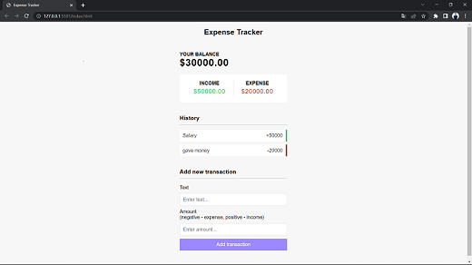

# Expense Tracker

It's a Expense Tracker website, which help you to track your expense with your previous history of expense(previous history??? so that you don't lost your track while tracking your expense😉).

Previous history and present updation will calculate and then thus provide us a Output in the format of Income, Expense and Your Balance.

## Tech used

    - HTML
    - CSS
    - JavaScript

## Appendix

It's simple to use.
you just need to need to enter your expense amount with negative sign and where you have spend your precious money 
and if money is credited in your account then just add positive sign with the amount and in blink of your eye everthing will be done.

## Features

- Create UI for project
- Display transaction items in DOM
- Show balance, expense, and income totals
- Add new transaction and reflect in total
- Delete items from DOM
- Persist to local storage

## Screenshots

  

## Deployment

To deploy this project run

<a src="https://shivansh63.github.io/JS-Mini-Project---1---JavaScript-Mini-Project---iqfb9d9ulx54/">Website Link</a>

## Used By

This website can be used by a everyone since its a expense tracker everybody has their own expense but not everybody is good while tracking it down, so to make tracking hassle free this is the website you need 😄.
